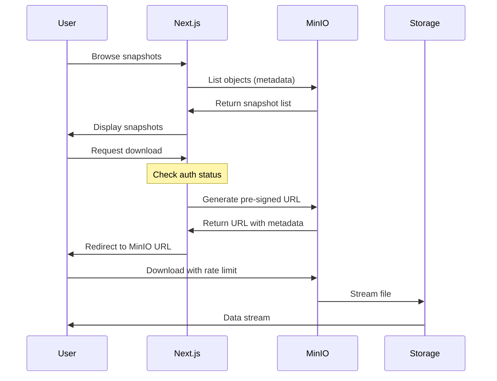
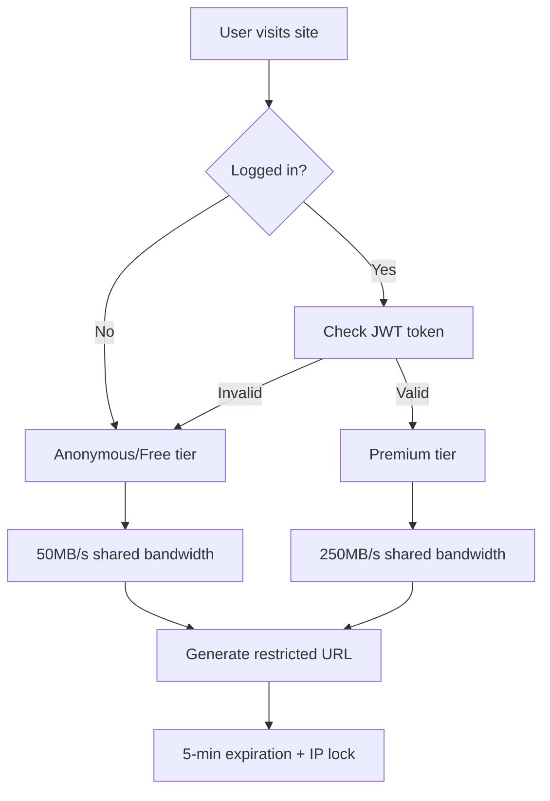

# Blockchain Snapshot Service - Product Requirements Document

## Table of Contents
1. [Executive Summary](#executive-summary)
2. [Architecture Overview](#architecture-overview)
3. [Technical Requirements](#technical-requirements)
4. [Component Specifications](#component-specifications)
5. [Security Model](#security-model)
6. [Bandwidth Management](#bandwidth-management)
7. [Monitoring & Observability](#monitoring--observability)
8. [API Specifications](#api-specifications)
9. [User Experience](#user-experience)
10. [Testing Strategy](#testing-strategy)
11. [Deployment Strategy](#deployment-strategy)
12. [Configuration Management](#configuration-management)
13. [Future Considerations](#future-considerations)

## Executive Summary

### Project Goal
Build a production-grade blockchain snapshot hosting service that provides reliable, bandwidth-managed access to blockchain snapshots with a tiered user system. The service will support both anonymous users (50MB/s shared) and authenticated premium users (250MB/s shared) while ensuring total bandwidth never exceeds 500MB/s.

### Key Features
- **MinIO-based object storage** on TopoLVM for snapshot hosting
- **Next.js full-stack application** for UI and API
- **Tiered bandwidth management** with configurable limits
- **Resume support** for interrupted downloads
- **Prometheus metrics** integration
- **GitOps-friendly** configuration

### Success Criteria
- Reliable snapshot downloads with 99.9% uptime
- Bandwidth limits enforced accurately (±5%)
- Support for 10+ concurrent downloads
- Sub-second API response times
- Zero snapshot corruption

## Architecture Overview

### High-Level Architecture
```
Internet → pfSense/HAProxy (SSL) → Kubernetes Cluster
                                          │
                    ┌─────────────────────┴─────────────────────┐
                    │                                           │
            Next.js App (2+ replicas)              MinIO (2+ replicas)
                    │                                           │
                    └─────────────────────┬─────────────────────┘
                                          │
                                  TopoLVM Storage (NVMe)
```

### Component Interaction Flow


## Technical Requirements

### Infrastructure Requirements
- **Kubernetes**: 1.24+ with TopoLVM CSI driver
- **Storage**: 5-10TB NVMe via TopoLVM (expandable)
- **Network**: 1Gbps connection (500MB/s allocated for snapshots)
- **SSL**: Terminated at pfSense/HAProxy
- **Monitoring**: Prometheus/Grafana stack (existing)

### Software Requirements
- **MinIO**: Latest stable (RELEASE.2024-01-16T16-07-38Z or newer)
- **Next.js**: 14.0+ with App Router
- **Node.js**: 20.x LTS
- **TypeScript**: 5.0+

### Performance Requirements
- **API Response Time**: <200ms p95
- **Time to First Byte**: <500ms for downloads
- **Concurrent Downloads**: 50+ supported
- **Bandwidth Accuracy**: ±5% of configured limits

## Component Specifications

### MinIO Object Storage

#### Deployment Configuration
```yaml
apiVersion: apps/v1
kind: Deployment
metadata:
  name: minio
  namespace: apps
spec:
  replicas: 2  # HA even on single node
  selector:
    matchLabels:
      app: minio
  template:
    metadata:
      labels:
        app: minio
    spec:
      containers:
      - name: minio
        image: minio/minio:RELEASE.2024-01-16T16-07-38Z
        args:
        - server
        - /data
        - --console-address
        - ":9001"
        env:
        - name: MINIO_ROOT_USER
          valueFrom:
            secretKeyRef:
              name: minio-credentials
              key: root-user
        - name: MINIO_ROOT_PASSWORD
          valueFrom:
            secretKeyRef:
              name: minio-credentials
              key: root-password
        - name: MINIO_PROMETHEUS_AUTH_TYPE
          value: "public"
        - name: MINIO_API_REQUESTS_MAX
          value: "500"  # Prevent DoS
        - name: MINIO_API_REQUESTS_DEADLINE
          value: "1m"
        ports:
        - containerPort: 9000
          name: api
        - containerPort: 9001
          name: console
        volumeMounts:
        - name: storage
          mountPath: /data
        livenessProbe:
          httpGet:
            path: /minio/health/live
            port: 9000
          initialDelaySeconds: 30
          periodSeconds: 30
        readinessProbe:
          httpGet:
            path: /minio/health/ready
            port: 9000
          initialDelaySeconds: 10
          periodSeconds: 10
        resources:
          requests:
            cpu: 500m
            memory: 1Gi
          limits:
            cpu: 2000m
            memory: 4Gi
      volumes:
      - name: storage
        persistentVolumeClaim:
          claimName: minio-storage
```

#### MinIO Bucket Policy Configuration
```json
{
  "Version": "2012-10-17",
  "Statement": [
    {
      "Effect": "Allow",
      "Principal": {"AWS": ["*"]},
      "Action": ["s3:GetObject"],
      "Resource": ["arn:aws:s3:::snapshots/*"],
      "Condition": {
        "StringLike": {
          "s3:ExistingObjectTag/tier": ["free", "premium"]
        }
      }
    }
  ]
}
```

#### Bandwidth Management Script
```bash
#!/bin/bash
# minio-bandwidth-manager.sh
# This script manages MinIO bandwidth based on active connections

while true; do
  # Get current connection count by tier
  FREE_CONNECTIONS=$(mc admin trace myminio | grep -c "tier:free" || echo 0)
  PREMIUM_CONNECTIONS=$(mc admin trace myminio | grep -c "tier:premium" || echo 0)
  
  # Calculate per-connection bandwidth
  if [ $FREE_CONNECTIONS -gt 0 ]; then
    FREE_PER_CONN=$((50 / FREE_CONNECTIONS))  # 50MB/s total for free
  else
    FREE_PER_CONN=50
  fi
  
  if [ $PREMIUM_CONNECTIONS -gt 0 ]; then
    PREMIUM_PER_CONN=$((250 / PREMIUM_CONNECTIONS))  # 250MB/s total for premium
  else
    PREMIUM_PER_CONN=250
  fi
  
  # Apply bandwidth limits via MinIO admin API
  mc admin config set myminio api \
    requests_max=500 \
    requests_deadline=1m \
    ready_deadline=30s
  
  sleep 10
done
```

### Next.js Full-Stack Application

#### Project Structure
```
snapshot-website/
├── app/
│   ├── api/
│   │   ├── v1/
│   │   │   ├── chains/
│   │   │   │   ├── route.ts              # GET /api/v1/chains
│   │   │   │   └── [chainId]/
│   │   │   │       ├── route.ts          # GET /api/v1/chains/[chainId]
│   │   │   │       ├── snapshots/
│   │   │   │       │   └── route.ts      # GET /api/v1/chains/[chainId]/snapshots
│   │   │   │       └── download/
│   │   │   │           └── route.ts      # POST /api/v1/chains/[chainId]/download
│   │   │   └── auth/
│   │   │       ├── login/
│   │   │       │   └── route.ts          # POST /api/v1/auth/login
│   │   │       └── logout/
│   │   │           └── route.ts          # POST /api/v1/auth/logout
│   │   └── health/
│   │       └── route.ts                  # GET /api/health
│   ├── chains/
│   │   ├── page.tsx                      # Snapshot listing page
│   │   └── [chainId]/
│   │       └── page.tsx                  # Chain-specific snapshots
│   ├── login/
│   │   └── page.tsx                      # Login page
│   ├── layout.tsx                        # Root layout with auth context
│   └── page.tsx                          # Homepage
├── lib/
│   ├── auth/
│   │   ├── session.ts                    # Session management
│   │   └── middleware.ts                 # Auth middleware
│   ├── minio/
│   │   ├── client.ts                     # MinIO client setup
│   │   └── operations.ts                 # MinIO operations
│   ├── config/
│   │   └── index.ts                      # Configuration management
│   └── types/
│       └── index.ts                      # TypeScript types
├── components/
│   ├── auth/
│   │   └── LoginForm.tsx                 # Login component
│   ├── snapshots/
│   │   ├── SnapshotList.tsx             # Snapshot listing
│   │   └── DownloadButton.tsx            # Download with auth check
│   └── common/
│       ├── Header.tsx                    # Site header with auth status
│       └── BandwidthIndicator.tsx        # Current bandwidth usage
├── middleware.ts                         # Next.js middleware for auth
└── next.config.js                        # Next.js configuration
```

#### Core API Implementation

##### Authentication Handler
```typescript
// app/api/v1/auth/login/route.ts
import { NextRequest, NextResponse } from 'next/server'
import bcrypt from 'bcryptjs'
import jwt from 'jsonwebtoken'
import { cookies } from 'next/headers'

interface LoginRequest {
  username: string
  password: string
}

export async function POST(request: NextRequest) {
  try {
    const body: LoginRequest = await request.json()
    
    // Get credentials from environment
    const PREMIUM_USER = process.env.PREMIUM_USERNAME!
    const PREMIUM_PASS_HASH = process.env.PREMIUM_PASSWORD_HASH!
    const JWT_SECRET = process.env.JWT_SECRET!
    
    // Validate credentials
    if (body.username !== PREMIUM_USER) {
      return NextResponse.json(
        { error: 'Invalid credentials' },
        { status: 401 }
      )
    }
    
    const validPassword = await bcrypt.compare(body.password, PREMIUM_PASS_HASH)
    if (!validPassword) {
      return NextResponse.json(
        { error: 'Invalid credentials' },
        { status: 401 }
      )
    }
    
    // Generate JWT token
    const token = jwt.sign(
      { 
        username: body.username,
        tier: 'premium',
        iat: Date.now()
      },
      JWT_SECRET,
      { expiresIn: '7d' }
    )
    
    // Set secure cookie
    cookies().set('auth-token', token, {
      httpOnly: true,
      secure: process.env.NODE_ENV === 'production',
      sameSite: 'lax',
      maxAge: 60 * 60 * 24 * 7 // 7 days
    })
    
    return NextResponse.json({ 
      success: true,
      user: { username: body.username, tier: 'premium' }
    })
    
  } catch (error) {
    console.error('Login error:', error)
    return NextResponse.json(
      { error: 'Internal server error' },
      { status: 500 }
    )
  }
}
```

##### Download URL Generator
```typescript
// app/api/v1/chains/[chainId]/download/route.ts
import { NextRequest, NextResponse } from 'next/server'
import { getMinioClient } from '@/lib/minio/client'
import { verifyAuth } from '@/lib/auth/middleware'
import { headers } from 'next/headers'

interface DownloadRequest {
  filename?: string  // Optional, defaults to 'latest'
}

export async function POST(
  request: NextRequest,
  { params }: { params: { chainId: string } }
) {
  try {
    const { chainId } = params
    const body: DownloadRequest = await request.json()
    const filename = body.filename || 'latest.tar.lz4'
    
    // Get user tier from auth
    const authResult = await verifyAuth(request)
    const userTier = authResult?.tier || 'free'
    
    // Get client IP for restriction
    const headersList = headers()
    const clientIp = headersList.get('x-forwarded-for') || 
                    headersList.get('x-real-ip') || 
                    '127.0.0.1'
    
    // Generate pre-signed URL with metadata
    const minio = getMinioClient()
    const objectName = `${chainId}/${filename}`
    
    // Check if object exists
    try {
      await minio.statObject('snapshots', objectName)
    } catch (error) {
      return NextResponse.json(
        { error: 'Snapshot not found' },
        { status: 404 }
      )
    }
    
    // Set bandwidth tier in object metadata
    const reqParams = {
      'response-content-disposition': `attachment; filename="${chainId}-${filename}"`,
      'X-Amz-Meta-User-Tier': userTier,
      'X-Amz-Meta-Allowed-Ip': clientIp,
      'X-Amz-Meta-Request-Id': crypto.randomUUID()
    }
    
    // Generate URL with 5-minute expiration
    const downloadUrl = await minio.presignedGetObject(
      'snapshots',
      objectName,
      5 * 60, // 5 minutes
      reqParams
    )
    
    // Log download request for analytics
    console.log({
      event: 'download_requested',
      chainId,
      filename,
      userTier,
      clientIp,
      timestamp: new Date().toISOString()
    })
    
    return NextResponse.json({
      url: downloadUrl,
      expires_in: 300,
      tier: userTier,
      bandwidth_limit: userTier === 'premium' ? '250MB/s shared' : '50MB/s shared'
    })
    
  } catch (error) {
    console.error('Download URL generation error:', error)
    return NextResponse.json(
      { error: 'Failed to generate download URL' },
      { status: 500 }
    )
  }
}
```

##### Snapshot Listing API
```typescript
// app/api/v1/chains/[chainId]/snapshots/route.ts
import { NextRequest, NextResponse } from 'next/server'
import { getMinioClient } from '@/lib/minio/client'

interface SnapshotMetadata {
  chain_id: string
  block_height: number
  size_bytes: number
  timestamp: string
  sha256: string
}

export async function GET(
  request: NextRequest,
  { params }: { params: { chainId: string } }
) {
  try {
    const { chainId } = params
    const minio = getMinioClient()
    
    // List all objects for this chain
    const objectsList = []
    const stream = minio.listObjectsV2('snapshots', chainId + '/', true)
    
    for await (const obj of stream) {
      if (obj.name?.endsWith('.json')) {
        // Fetch metadata file
        const metadataStream = await minio.getObject('snapshots', obj.name)
        const metadata: SnapshotMetadata = JSON.parse(
          await streamToString(metadataStream)
        )
        
        // Get corresponding .tar.lz4 file info
        const snapshotName = obj.name.replace('.json', '.tar.lz4')
        try {
          const stat = await minio.statObject('snapshots', snapshotName)
          
          objectsList.push({
            ...metadata,
            filename: snapshotName.split('/').pop(),
            size_human: humanFileSize(metadata.size_bytes),
            download_size: stat.size,
            download_size_human: humanFileSize(stat.size),
            last_modified: stat.lastModified
          })
        } catch (error) {
          // Skip if .tar.lz4 doesn't exist
          console.warn(`Snapshot file not found: ${snapshotName}`)
        }
      }
    }
    
    // Sort by timestamp descending
    objectsList.sort((a, b) => 
      new Date(b.timestamp).getTime() - new Date(a.timestamp).getTime()
    )
    
    // Get latest symlink info
    let latest = null
    try {
      const latestStat = await minio.statObject('snapshots', `${chainId}/latest.tar.lz4`)
      latest = {
        filename: 'latest.tar.lz4',
        size: latestStat.size,
        size_human: humanFileSize(latestStat.size),
        last_modified: latestStat.lastModified
      }
    } catch (error) {
      // No latest symlink
    }
    
    return NextResponse.json({
      chain_id: chainId,
      snapshots: objectsList,
      latest,
      count: objectsList.length
    })
    
  } catch (error) {
    console.error('Snapshot listing error:', error)
    return NextResponse.json(
      { error: 'Failed to list snapshots' },
      { status: 500 }
    )
  }
}

// Helper functions
async function streamToString(stream: any): Promise<string> {
  const chunks = []
  for await (const chunk of stream) {
    chunks.push(chunk)
  }
  return Buffer.concat(chunks).toString('utf8')
}

function humanFileSize(bytes: number): string {
  const thresh = 1024
  if (Math.abs(bytes) < thresh) {
    return bytes + ' B'
  }
  const units = ['KiB', 'MiB', 'GiB', 'TiB']
  let u = -1
  do {
    bytes /= thresh
    ++u
  } while (Math.abs(bytes) >= thresh && u < units.length - 1)
  return bytes.toFixed(1) + ' ' + units[u]
}
```

#### Frontend Components

##### Download Button with Auth Check
```typescript
// components/snapshots/DownloadButton.tsx
'use client'

import { useState } from 'react'
import { useAuth } from '@/lib/auth/context'
import { useRouter } from 'next/navigation'

interface DownloadButtonProps {
  chainId: string
  filename: string
  size: string
}

export function DownloadButton({ chainId, filename, size }: DownloadButtonProps) {
  const [loading, setLoading] = useState(false)
  const [error, setError] = useState<string | null>(null)
  const { user } = useAuth()
  const router = useRouter()
  
  const handleDownload = async () => {
    setLoading(true)
    setError(null)
    
    try {
      // Generate pre-signed URL
      const response = await fetch(`/api/v1/chains/${chainId}/download`, {
        method: 'POST',
        headers: { 'Content-Type': 'application/json' },
        body: JSON.stringify({ filename })
      })
      
      if (!response.ok) {
        throw new Error('Failed to generate download URL')
      }
      
      const data = await response.json()
      
      // Show bandwidth info
      const bandwidthInfo = user 
        ? `Premium tier: ${data.bandwidth_limit}`
        : `Free tier: ${data.bandwidth_limit} (Login for faster downloads)`
      
      if (!user && confirm(`${bandwidthInfo}\n\nProceed with download?`)) {
        window.location.href = data.url
      } else if (user) {
        window.location.href = data.url
      }
      
    } catch (err) {
      setError(err instanceof Error ? err.message : 'Download failed')
    } finally {
      setLoading(false)
    }
  }
  
  return (
    <div className="flex flex-col gap-2">
      <button
        onClick={handleDownload}
        disabled={loading}
        className={`
          px-4 py-2 rounded-md font-medium transition-colors
          ${loading 
            ? 'bg-gray-300 cursor-not-allowed' 
            : 'bg-blue-600 hover:bg-blue-700 text-white'
          }
        `}
      >
        {loading ? 'Generating URL...' : `Download (${size})`}
      </button>
      
      {error && (
        <p className="text-red-500 text-sm">{error}</p>
      )}
      
      {!user && (
        <p className="text-gray-600 text-sm">
          <a 
            href="/login" 
            className="text-blue-600 hover:underline"
            onClick={(e) => {
              e.preventDefault()
              router.push('/login')
            }}
          >
            Login
          </a>
          {' '}for 5x faster downloads
        </p>
      )}
    </div>
  )
}
```

## Security Model

### Authentication Flow


### Security Measures
1. **JWT-based authentication** with secure httpOnly cookies
2. **Pre-signed URLs** with 5-minute expiration
3. **IP-based restrictions** to prevent URL sharing
4. **Rate limiting** on URL generation (10 requests per minute)
5. **CORS configuration** to prevent unauthorized API access
6. **Input validation** on all API endpoints
7. **Secure headers** (CSP, HSTS, X-Frame-Options)

### Environment Variables
```bash
# .env.local (Next.js)
MINIO_ENDPOINT=http://minio.apps.svc.cluster.local:9000
MINIO_ACCESS_KEY=<generated>
MINIO_SECRET_KEY=<generated>
PREMIUM_USERNAME=premium_user
PREMIUM_PASSWORD_HASH=<bcrypt hash>
JWT_SECRET=<generated>
NEXT_PUBLIC_API_URL=https://snapshots.bryanlabs.net

# Kubernetes ConfigMap
BANDWIDTH_FREE_TOTAL=50
BANDWIDTH_PREMIUM_TOTAL=250
BANDWIDTH_MAX_TOTAL=500
AUTH_SESSION_DURATION=7d
DOWNLOAD_URL_EXPIRY=5m
```

## Bandwidth Management

### Bandwidth Allocation Strategy
```
Total Available: 500MB/s (4Gbps)
├── Free Tier: 50MB/s (shared among all free users)
├── Premium Tier: 250MB/s (shared among all premium users)
└── Reserved: 200MB/s (buffer for system/peaks)
```

### Dynamic Bandwidth Adjustment
```typescript
// lib/bandwidth/manager.ts
interface BandwidthConfig {
  freeTotal: number      // 50 MB/s
  premiumTotal: number   // 250 MB/s
  maxTotal: number       // 500 MB/s
}

class BandwidthManager {
  private config: BandwidthConfig
  private activeConnections: Map<string, ConnectionInfo>
  
  constructor(config: BandwidthConfig) {
    this.config = config
    this.activeConnections = new Map()
  }
  
  calculateUserBandwidth(tier: 'free' | 'premium'): number {
    const connections = Array.from(this.activeConnections.values())
    const tierConnections = connections.filter(c => c.tier === tier)
    
    if (tierConnections.length === 0) {
      return tier === 'free' ? this.config.freeTotal : this.config.premiumTotal
    }
    
    const totalForTier = tier === 'free' 
      ? this.config.freeTotal 
      : this.config.premiumTotal
      
    return Math.floor(totalForTier / tierConnections.length)
  }
  
  registerConnection(id: string, tier: 'free' | 'premium') {
    this.activeConnections.set(id, {
      id,
      tier,
      startTime: Date.now(),
      bandwidth: this.calculateUserBandwidth(tier)
    })
    
    // Rebalance all connections
    this.rebalanceConnections()
  }
  
  private rebalanceConnections() {
    // Recalculate bandwidth for all active connections
    for (const [id, conn] of this.activeConnections) {
      conn.bandwidth = this.calculateUserBandwidth(conn.tier)
      // Signal MinIO to update rate limit
      this.updateMinioRateLimit(id, conn.bandwidth)
    }
  }
}
```

### MinIO Bandwidth Plugin
```lua
-- minio-bandwidth.lua
-- Custom Lua script for MinIO gateway to enforce dynamic bandwidth

local tier_limits = {
  free = 50 * 1024 * 1024,      -- 50 MB/s total
  premium = 250 * 1024 * 1024   -- 250 MB/s total
}

local active_connections = {}

function get_user_tier(headers)
  local meta_tier = headers["X-Amz-Meta-User-Tier"]
  return meta_tier or "free"
end

function calculate_rate_limit(tier)
  local count = 0
  for _, conn in pairs(active_connections) do
    if conn.tier == tier then
      count = count + 1
    end
  end
  
  if count == 0 then
    return tier_limits[tier]
  end
  
  return math.floor(tier_limits[tier] / count)
end

function on_request_start(request_id, headers)
  local tier = get_user_tier(headers)
  local rate_limit = calculate_rate_limit(tier)
  
  active_connections[request_id] = {
    tier = tier,
    start_time = os.time(),
    rate_limit = rate_limit
  }
  
  return {
    rate_limit = rate_limit
  }
end

function on_request_end(request_id)
  active_connections[request_id] = nil
  -- Rebalance remaining connections
  for id, conn in pairs(active_connections) do
    conn.rate_limit = calculate_rate_limit(conn.tier)
  end
end
```

## Monitoring & Observability

### Key Metrics

#### Application Metrics
```yaml
# Prometheus metrics exported by Next.js
snapshot_api_requests_total{endpoint, method, status}
snapshot_api_response_time_seconds{endpoint, method}
snapshot_downloads_initiated_total{chain_id, tier}
snapshot_auth_attempts_total{result}
snapshot_active_sessions{tier}
```

#### MinIO Metrics
```yaml
# Native MinIO metrics
minio_s3_requests_total{api, bucket}
minio_s3_traffic_sent_bytes{bucket}
minio_s3_request_duration_seconds{api, bucket}
minio_bucket_usage_total_bytes{bucket}
minio_cluster_capacity_usable_free_bytes
```

#### Custom Bandwidth Metrics
```yaml
# Custom exporter for bandwidth tracking
snapshot_bandwidth_current_bytes_per_second{tier}
snapshot_bandwidth_connections_active{tier}
snapshot_bandwidth_throttled_connections_total{tier}
snapshot_bandwidth_total_consumed_bytes
```

### Grafana Dashboard Configuration
```json
{
  "dashboard": {
    "title": "Snapshot Service Overview",
    "panels": [
      {
        "title": "Current Bandwidth Usage",
        "targets": [
          {
            "expr": "sum(snapshot_bandwidth_current_bytes_per_second) by (tier)"
          }
        ]
      },
      {
        "title": "Active Downloads",
        "targets": [
          {
            "expr": "sum(snapshot_bandwidth_connections_active) by (tier)"
          }
        ]
      },
      {
        "title": "API Response Times (p95)",
        "targets": [
          {
            "expr": "histogram_quantile(0.95, snapshot_api_response_time_seconds)"
          }
        ]
      },
      {
        "title": "Storage Usage",
        "targets": [
          {
            "expr": "minio_bucket_usage_total_bytes{bucket=\"snapshots\"}"
          }
        ]
      }
    ]
  }
}
```

### Alerting Rules
```yaml
groups:
  - name: snapshot_service
    rules:
    - alert: BandwidthLimitExceeded
      expr: sum(snapshot_bandwidth_current_bytes_per_second) > 500 * 1024 * 1024
      for: 1m
      annotations:
        summary: "Total bandwidth exceeds 500MB/s limit"
        
    - alert: StorageSpaceLow
      expr: |
        minio_cluster_capacity_usable_free_bytes / 
        minio_cluster_capacity_usable_total_bytes < 0.1
      for: 5m
      annotations:
        summary: "MinIO storage space below 10%"
        
    - alert: HighAPILatency
      expr: |
        histogram_quantile(0.95, snapshot_api_response_time_seconds) > 1
      for: 5m
      annotations:
        summary: "API p95 latency above 1 second"
        
    - alert: AuthenticationFailureSpike
      expr: |
        rate(snapshot_auth_attempts_total{result="failure"}[5m]) > 10
      annotations:
        summary: "High rate of authentication failures"
```

## API Specifications

### RESTful API Endpoints

#### Public Endpoints
```yaml
GET /api/v1/chains
  Description: List all chains with available snapshots
  Response:
    {
      "chains": [
        {
          "chain_id": "noble-1",
          "name": "Noble",
          "latest_snapshot": {
            "block_height": 1234567,
            "timestamp": "2024-01-10T10:00:00Z",
            "size": "7.3GB"
          }
        }
      ]
    }

GET /api/v1/chains/{chainId}
  Description: Get details for specific chain
  Response:
    {
      "chain_id": "noble-1",
      "name": "Noble",
      "snapshot_count": 1,
      "total_size": "7.3GB",
      "latest_block": 1234567
    }

GET /api/v1/chains/{chainId}/snapshots
  Description: List all snapshots for a chain
  Response:
    {
      "chain_id": "noble-1",
      "snapshots": [
        {
          "filename": "noble-1-1234567.tar.lz4",
          "block_height": 1234567,
          "size": "7.3GB",
          "timestamp": "2024-01-10T10:00:00Z",
          "sha256": "abc123..."
        }
      ],
      "latest": {
        "filename": "latest.tar.lz4",
        "size": "7.3GB"
      }
    }

POST /api/v1/chains/{chainId}/download
  Description: Generate pre-signed download URL
  Request:
    {
      "filename": "latest.tar.lz4"  // optional
    }
  Response:
    {
      "url": "https://...",
      "expires_in": 300,
      "tier": "free",
      "bandwidth_limit": "50MB/s shared"
    }
```

#### Authentication Endpoints
```yaml
POST /api/v1/auth/login
  Description: Authenticate user
  Request:
    {
      "username": "premium_user",
      "password": "password"
    }
  Response:
    {
      "success": true,
      "user": {
        "username": "premium_user",
        "tier": "premium"
      }
    }

POST /api/v1/auth/logout
  Description: Logout current user
  Response:
    {
      "success": true
    }

GET /api/v1/auth/me
  Description: Get current user info
  Response:
    {
      "authenticated": true,
      "user": {
        "username": "premium_user",
        "tier": "premium"
      }
    }
```

#### Health & Metrics
```yaml
GET /api/health
  Description: Health check endpoint
  Response:
    {
      "status": "healthy",
      "version": "1.0.0",
      "services": {
        "minio": "connected",
        "database": "connected"
      }
    }

GET /api/metrics
  Description: Prometheus metrics endpoint
  Response: text/plain prometheus format
```

## User Experience

### User Flows

#### Anonymous User Flow
1. User visits homepage → Sees list of available chains
2. Clicks on chain → Views available snapshots with sizes
3. Clicks download → Sees bandwidth tier notice
4. Confirms download → Receives file at 50MB/s shared rate
5. Optional: Prompted to login for faster speeds

#### Premium User Flow
1. User visits homepage → Clicks login
2. Enters credentials → Redirected to dashboard
3. Sees "Premium" badge and benefits
4. Downloads snapshot → Gets 250MB/s shared rate
5. Can download multiple files with session persistence

### UI/UX Requirements
- **Responsive design** for mobile/tablet/desktop
- **Dark mode** support with system preference detection
- **Loading states** for all async operations
- **Error handling** with user-friendly messages
- **Download progress** indication (browser native)
- **Bandwidth indicator** showing current tier and speed

### Accessibility Requirements
- **WCAG 2.1 AA** compliance
- **Keyboard navigation** for all interactive elements
- **Screen reader** friendly markup
- **Color contrast** ratios meeting standards
- **Focus indicators** clearly visible

## Testing Strategy

### Unit Testing
```typescript
// Example test for download URL generation
describe('Download API', () => {
  it('should generate URL for free tier', async () => {
    const response = await request(app)
      .post('/api/v1/chains/noble-1/download')
      .send({ filename: 'latest.tar.lz4' })
      
    expect(response.status).toBe(200)
    expect(response.body).toHaveProperty('url')
    expect(response.body.tier).toBe('free')
    expect(response.body.bandwidth_limit).toBe('50MB/s shared')
  })
  
  it('should generate URL for premium tier', async () => {
    const token = await loginAsPremium()
    
    const response = await request(app)
      .post('/api/v1/chains/noble-1/download')
      .set('Cookie', `auth-token=${token}`)
      .send({ filename: 'latest.tar.lz4' })
      
    expect(response.status).toBe(200)
    expect(response.body.tier).toBe('premium')
    expect(response.body.bandwidth_limit).toBe('250MB/s shared')
  })
})
```

### Integration Testing
```typescript
// Test MinIO integration
describe('MinIO Integration', () => {
  it('should list snapshots from MinIO', async () => {
    // Upload test snapshot
    await uploadTestSnapshot('test-chain', 'test.tar.lz4')
    
    // Call API
    const response = await request(app)
      .get('/api/v1/chains/test-chain/snapshots')
      
    expect(response.body.snapshots).toHaveLength(1)
    expect(response.body.snapshots[0].filename).toBe('test.tar.lz4')
  })
})
```

### Load Testing
```javascript
// k6 load test script
import http from 'k6/http'
import { check, sleep } from 'k6'

export const options = {
  stages: [
    { duration: '2m', target: 10 },   // Ramp to 10 users
    { duration: '5m', target: 50 },   // Ramp to 50 users  
    { duration: '2m', target: 100 },  // Ramp to 100 users
    { duration: '5m', target: 100 },  // Stay at 100 users
    { duration: '2m', target: 0 },    // Ramp down
  ],
  thresholds: {
    http_req_duration: ['p(95)<500'], // 95% of requests under 500ms
    http_req_failed: ['rate<0.1'],    // Error rate under 10%
  },
}

export default function () {
  // List chains
  const chains = http.get('https://snapshots.bryanlabs.net/api/v1/chains')
  check(chains, {
    'chains status 200': (r) => r.status === 200,
  })
  
  // Generate download URL
  const download = http.post(
    'https://snapshots.bryanlabs.net/api/v1/chains/noble-1/download',
    JSON.stringify({ filename: 'latest.tar.lz4' }),
    { headers: { 'Content-Type': 'application/json' } }
  )
  check(download, {
    'download URL generated': (r) => r.status === 200,
    'URL present': (r) => JSON.parse(r.body).url !== undefined,
  })
  
  sleep(1)
}
```

### End-to-End Testing
```typescript
// Playwright E2E test
import { test, expect } from '@playwright/test'

test('complete download flow', async ({ page }) => {
  // Visit homepage
  await page.goto('/')
  await expect(page).toHaveTitle(/Blockchain Snapshots/)
  
  // Click on Noble chain
  await page.click('text=Noble')
  await expect(page).toHaveURL('/chains/noble-1')
  
  // Check snapshot is listed
  await expect(page.locator('text=latest.tar.lz4')).toBeVisible()
  
  // Click download
  await page.click('button:has-text("Download")')
  
  // Should see tier notice
  await expect(page.locator('text=50MB/s shared')).toBeVisible()
  
  // Login link should be visible
  await expect(page.locator('a:has-text("Login")')).toBeVisible()
})

test('premium user flow', async ({ page }) => {
  // Login first
  await page.goto('/login')
  await page.fill('input[name="username"]', 'premium_user')
  await page.fill('input[name="password"]', 'test_password')
  await page.click('button[type="submit"]')
  
  // Should redirect to homepage
  await expect(page).toHaveURL('/')
  
  // Should see premium badge
  await expect(page.locator('text=Premium')).toBeVisible()
  
  // Download should show premium speed
  await page.goto('/chains/noble-1')
  await page.click('button:has-text("Download")')
  
  // No confirmation needed for premium
  const downloadPromise = page.waitForEvent('download')
  const download = await downloadPromise
  expect(download.suggestedFilename()).toBe('noble-1-latest.tar.lz4')
})
```

## Deployment Strategy

### Kubernetes Deployment

#### Namespace Structure
```yaml
apiVersion: v1
kind: Namespace
metadata:
  name: apps
  labels:
    name: apps
    monitoring: enabled
```

#### Resource Definitions
```yaml
# Complete deployment manifests in cluster/apps/snapshot-website/
# Complete MinIO manifests in cluster/apps/minio-snapshots/

# Key resources:
- Deployment (Next.js app, 2+ replicas)
- Deployment (MinIO, 2+ replicas)  
- Service (ClusterIP for both)
- PVC (TopoLVM storage)
- ConfigMap (configuration)
- Secret (credentials)
- ServiceMonitor (Prometheus)
```

### CI/CD Pipeline
```yaml
# .github/workflows/snapshot-service.yml
name: Snapshot Service CI/CD

on:
  push:
    branches: [main]
    paths:
      - 'snapshots/**'
      - 'cluster/apps/snapshot-website/**'
      - 'cluster/apps/minio-snapshots/**'

jobs:
  test:
    runs-on: ubuntu-latest
    steps:
      - uses: actions/checkout@v3
      - uses: actions/setup-node@v3
        with:
          node-version: '20'
          
      - name: Install dependencies
        run: cd snapshots && npm ci
        
      - name: Run tests
        run: cd snapshots && npm test
        
      - name: Run E2E tests
        run: cd snapshots && npm run test:e2e

  build:
    needs: test
    runs-on: ubuntu-latest
    steps:
      - uses: actions/checkout@v3
      
      - name: Build Docker image
        run: |
          cd snapshots
          docker build -t ghcr.io/bryanlabs/snapshot-website:$GITHUB_SHA .
          
      - name: Push to registry
        run: |
          echo ${{ secrets.GITHUB_TOKEN }} | docker login ghcr.io -u ${{ github.actor }} --password-stdin
          docker push ghcr.io/bryanlabs/snapshot-website:$GITHUB_SHA
          docker tag ghcr.io/bryanlabs/snapshot-website:$GITHUB_SHA ghcr.io/bryanlabs/snapshot-website:latest
          docker push ghcr.io/bryanlabs/snapshot-website:latest

  deploy:
    needs: build
    runs-on: ubuntu-latest
    steps:
      - uses: actions/checkout@v3
      
      - name: Update Kubernetes manifests
        run: |
          cd cluster/apps/snapshot-website
          sed -i "s|image: ghcr.io/bryanlabs/snapshot-website:.*|image: ghcr.io/bryanlabs/snapshot-website:$GITHUB_SHA|" deployment.yaml
          
      - name: Commit and push
        run: |
          git config --global user.name 'GitHub Actions'
          git config --global user.email 'actions@github.com'
          git commit -am "Update snapshot-website image to $GITHUB_SHA"
          git push
```

### Rollout Strategy
1. **Blue-Green Deployment** for zero-downtime updates
2. **Canary Releases** for testing new features
3. **Rollback Plan** using Flux/ArgoCD
4. **Health Checks** before promoting new version

## Configuration Management

### Environment Configuration
```yaml
# cluster/apps/snapshot-website/configmap.yaml
apiVersion: v1
kind: ConfigMap
metadata:
  name: snapshot-website-config
data:
  # Bandwidth limits (MB/s)
  BANDWIDTH_FREE_TOTAL: "50"
  BANDWIDTH_PREMIUM_TOTAL: "250"
  BANDWIDTH_MAX_TOTAL: "500"
  
  # MinIO connection
  MINIO_ENDPOINT: "http://minio.apps.svc.cluster.local:9000"
  MINIO_BUCKET: "snapshots"
  
  # Auth settings
  AUTH_SESSION_DURATION: "7d"
  DOWNLOAD_URL_EXPIRY: "5m"
  
  # Rate limiting
  RATE_LIMIT_WINDOW: "60s"
  RATE_LIMIT_MAX_REQUESTS: "10"
```

### Secret Management
```yaml
# cluster/apps/snapshot-website/secrets.yaml
apiVersion: v1
kind: Secret
metadata:
  name: snapshot-website-secrets
type: Opaque
stringData:
  MINIO_ACCESS_KEY: "minioadmin"  # Change in production
  MINIO_SECRET_KEY: "minioadmin"  # Change in production
  PREMIUM_USERNAME: "premium_user"
  PREMIUM_PASSWORD_HASH: "$2a$10$..."  # bcrypt hash
  JWT_SECRET: "your-secret-key"       # Generate with openssl rand -hex 32
```

### Dynamic Configuration Updates
```typescript
// lib/config/index.ts
interface Config {
  bandwidth: {
    freeTotal: number
    premiumTotal: number
    maxTotal: number
  }
  auth: {
    sessionDuration: string
    downloadUrlExpiry: string
  }
  rateLimit: {
    windowMs: number
    maxRequests: number
  }
}

class ConfigManager {
  private config: Config
  private watchInterval: NodeJS.Timeout
  
  constructor() {
    this.config = this.loadConfig()
    this.watchForChanges()
  }
  
  private loadConfig(): Config {
    return {
      bandwidth: {
        freeTotal: parseInt(process.env.BANDWIDTH_FREE_TOTAL || '50'),
        premiumTotal: parseInt(process.env.BANDWIDTH_PREMIUM_TOTAL || '250'),
        maxTotal: parseInt(process.env.BANDWIDTH_MAX_TOTAL || '500')
      },
      auth: {
        sessionDuration: process.env.AUTH_SESSION_DURATION || '7d',
        downloadUrlExpiry: process.env.DOWNLOAD_URL_EXPIRY || '5m'
      },
      rateLimit: {
        windowMs: parseDuration(process.env.RATE_LIMIT_WINDOW || '60s'),
        maxRequests: parseInt(process.env.RATE_LIMIT_MAX_REQUESTS || '10')
      }
    }
  }
  
  private watchForChanges() {
    // Re-read config every 30 seconds
    this.watchInterval = setInterval(() => {
      const newConfig = this.loadConfig()
      if (JSON.stringify(newConfig) !== JSON.stringify(this.config)) {
        console.log('Configuration changed, reloading...')
        this.config = newConfig
        this.notifyListeners()
      }
    }, 30000)
  }
}
```

## Future Considerations

### Phase 2 Enhancements
1. **Multiple User Tiers**
   - Bronze: 10MB/s
   - Silver: 50MB/s  
   - Gold: 100MB/s
   - Platinum: Unlimited (within total cap)

2. **Payment Integration**
   - Stripe/PayPal integration
   - Subscription management
   - Usage-based billing

3. **Advanced Features**
   - Torrent generation for P2P distribution
   - IPFS pinning for decentralized hosting
   - Incremental snapshots
   - Compression options (zstd, xz)

4. **Geographic Distribution**
   - CDN integration (Cloudflare R2)
   - Multi-region MinIO clusters
   - Edge caching

### Scaling Considerations
1. **Horizontal Scaling**
   - MinIO distributed mode (4+ nodes)
   - Next.js with multiple replicas
   - Redis for session storage
   - PostgreSQL for user management

2. **Performance Optimizations**
   - SSD caching layer
   - Bandwidth prediction algorithms
   - Connection pooling
   - HTTP/3 support

3. **Monitoring Enhancements**
   - Real-time bandwidth dashboard
   - User analytics
   - Cost tracking
   - SLA monitoring

### Security Enhancements
1. **Advanced Authentication**
   - OAuth2/OIDC support
   - 2FA for premium accounts
   - API keys for automation

2. **DDoS Protection**
   - Rate limiting by IP
   - Cloudflare integration
   - Fail2ban for repeat offenders

3. **Audit Logging**
   - Complete download history
   - Access patterns analysis
   - Compliance reporting

## Conclusion

This PRD provides a comprehensive blueprint for building a production-grade blockchain snapshot service. The architecture prioritizes:

- **Reliability** through redundant deployments and health checks
- **Performance** with bandwidth management and caching
- **Security** via authentication and access controls  
- **Scalability** using cloud-native patterns
- **Observability** with extensive monitoring

The implementation follows cloud-native best practices while remaining pragmatic for the initial scale of 10 chains and 10 users, with clear paths for growth to enterprise scale.